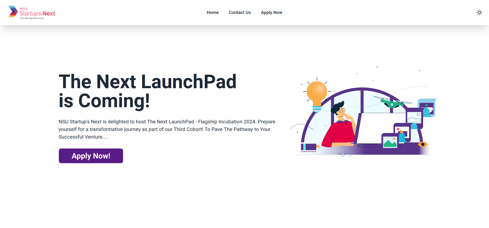

<div align="center">
<h1>NSUSN Forms</h1>

<p>Application Form and Contact Form for NSUSN (Frontend + Backend)</p>

<br>


<br>



</div>

## Links

-   **API Link:** https://nsusn-forms.up.railway.app/api/v1/applicants
-   **Frontend Link:** https://nsusn-forms.vercel.app

## Tech Stack

-   **Frontend:** HTML5, CSS3, Tailwind CSS, React.js
-   **Backend:** Node.js, Express.js, Mongoose, MongoDB Atlas
-   **Deployment:** Vercel, Railway
-   **Version Control:** Git, GitHub
-   **Package Manager and Bundler:** pnpm, vite
-   **Editor:** VSCode

## Run Locally (Frontend + Backend)

-   Clone the project

```bash
  git clone https://github.com/MusfiqDehan/nsusn-forms.git
```

-   Change the directory

```bash
  cd nsusn-forms
```

-   **For Frontend**

-   Change the directory

```bash
  cd frontend
```

-   Install dependencies

```bash
  pnpm install
```

-   Start the development server

```bash
  pnpm run dev
```

-   Install dependencies

```bash
  npm install
```

Start the development server

```bash
  npm run dev
```

-   **For Backend**

-   Change the directory

```bash
  cd backend
```

-   Install dependencies

```bash
  pnpm install
```

-   Start the development server

```bash
  pnpm run dev
```

## Environment Variables

To run this project, you will need to add the following environment variables to your .env file

-   **MONGODB_URI:** MongoDB Atlas URI

## API Reference

#### Get all applicants

```http
  GET /api/v1/applicants
```
